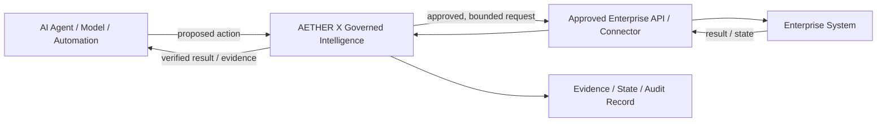

<p align="center">
  
</p>

<h1 align="center">AETHER X Governed Intelligence</h1>

<p align="center"><strong>Institutional Intelligence. Governed Autonomy.</strong></p>
<p align="center"><strong>Build Intelligence That Can Be Trusted to Act.</strong></p>

<p align="center">
  <code>PUBLIC TECHNOLOGY SHOWCASE · CONTROLLED DISCLOSURE · NO GENERAL OPEN-SOURCE LICENCE</code>
</p>

> **Quick orientation:** AETHER X Governed Intelligence is intended to operate as a governed execution layer between AI intent and approved enterprise systems. AI systems may propose or request actions; AETHER X keeps authority, state, execution and verification explicit before and after an approved enterprise action.
>
> **Current status:** R&D / pre-production evaluation stage. This public repository is a non-confidential technology surface, not a production runtime or supported SDK.

**AETHER X GLOBAL is a multidisciplinary research and technology company operating across financial markets, artificial intelligence, advanced computing and applied research. Governed Intelligence is its current flagship public enterprise-technology initiative, and this repository covers that technology specifically rather than the company's entire portfolio.**

**Technology scope:** governed enterprise AI execution and distributed-systems engineering. **AETHER X Governed Intelligence is not a cybersecurity product, offensive-security product, threat-detection system or cyber-defense offering.**

[Executive Brief](./docs/EXECUTIVE_BRIEF.md) · [Enterprise Integration Model](./docs/ENTERPRISE_INTEGRATION_MODEL.md) · [Enterprise Evaluation](./docs/ENTERPRISE_EVALUATION.md) · [Public Developer Tool: ReproCert](./tools/reprocert/README.md)

---

## Overview

AETHER X Governed Intelligence is the technology direction through which **AETHER X GLOBAL** engineers advanced AI systems for consequential institutional workflows where model capability alone is not sufficient.

The central thesis is simple:

> **Intelligence becomes institutionally useful when evidence, decision, authority, controlled action, verification and accountability are engineered as one governed system.**

AETHER X does not treat model output as authority. The technology is designed around explicit trust boundaries, bounded permissions, independent verification and durable evidence of what occurred.

This repository is the **public corporate technology surface** for Governed Intelligence. It is intentionally non-enabling: proprietary source code, detailed implementation contracts, internal schemas, validators, adversarial test suites, release tooling and confidential engineering evidence are maintained in private AETHER X systems.

For a concise partner-facing summary, see **[Executive Technology Brief](./docs/EXECUTIVE_BRIEF.md)**.

---

## Where AETHER X Sits

The simplest enterprise view is:

```text
AI AGENT / MODEL / AUTOMATION
            ↓ proposed action
AETHER X GOVERNED INTELLIGENCE
            ↓ approved, bounded request
APPROVED ENTERPRISE API / CONNECTOR
            ↓
ENTERPRISE SYSTEM
            ↓ result / state
AETHER X GOVERNED INTELLIGENCE
            ↓
VERIFIED RESULT / EVIDENCE
```

The same flow can be visualized as:



In plain language:

1. An AI agent, model-enabled workflow or automation proposes an action.
2. The request enters the AETHER X governed boundary.
3. The applicable authority, policy and workflow state are evaluated for the agreed use case.
4. If allowed, the request is passed only through an approved enterprise interface.
5. The enterprise system performs its own function.
6. The result returns through the governed boundary so execution state and evidence can be preserved and reviewed.

AETHER X is **not** intended to replace the model, the bank, telecom platform, ERP, CRM or other system of record. It is intended to sit at the boundary where intelligence becomes an enterprise action.

### Enterprise Integration Model

At a high level, AETHER X may be deployed as an agreed service or governed runtime/engine within a customer-controlled or jointly agreed environment, connected only to the enterprise interfaces approved for the scoped use case.

The exact packaging, hosting, networking and connector model is determined during technical scoping. AETHER X does **not** publicly commit at this stage to SaaS-only, on-premises-only, source-code delivery or any other single final production topology.

The standard evaluation path does **not** require transfer of proprietary core source code.

See **[Enterprise Integration Model](./docs/ENTERPRISE_INTEGRATION_MODEL.md)**.

---

## The Institutional Problem

Advanced AI can generate strong analysis while still leaving institutions exposed to failure modes that matter in real operations:

- evidence that cannot be traced;
- recommendations mistaken for approved decisions;
- technically available tools treated as permitted tools;
- excessive or stale authority;
- actions that complete without proving the intended outcome;
- insufficient separation between execution and verification;
- weak auditability across model, policy, human and system boundaries.

AETHER X Governed Intelligence addresses this class of problem at the **system architecture level**, not by assuming that a stronger model alone resolves institutional control.

---

## Technology Thesis

The Governed Intelligence model is organized around five high-level control domains:

```text
EVIDENCE & CONTEXT
        ↓
GOVERNED DECISION
        ↓
AUTHORITY BOUNDARY
        ↓
CONTROLLED ACTION
        ↓
VERIFICATION & AUDIT
```

These domains express several non-negotiable engineering separations:

`OUTPUT ≠ FACT`  
`RECOMMENDATION ≠ DECISION`  
`CAPABILITY ≠ AUTHORITY`  
`TOOL AVAILABILITY ≠ TOOL PERMISSION`  
`EXECUTION COMPLETE ≠ VERIFIED OUTCOME`

The purpose is not to eliminate autonomy. It is to make autonomy **bounded, attributable, reversible where appropriate, and proportionate to risk**.

---

## Core Engineering Principles

### Evidence before confidence
Material claims should remain traceable to source, time, provenance, assumptions and verification state.

### Authority before action
Technical capability does not create permission. Consequential actions require explicit, scoped and reviewable authority.

### Verification before acceptance
A completed action is not automatically a successful outcome. Verification is a separate engineering boundary.

### Fail closed at trust boundaries
Malformed, incomplete, stale or unauthorized states should not silently degrade into permissive behavior.

### Least privilege and bounded autonomy
Authority should be limited by identity, scope, duration, resource, action, parameter and revocation state as appropriate to the operating context.

### Auditability by construction
Evidence of decision, authority, action and verification should be designed into the system rather than reconstructed after the fact.

---

## Engineering Assurance

The current controlled engineering baseline has been subjected internally to a high-rigor validation program that includes:

- deterministic package-build validation;
- fail-closed boundary testing;
- adversarial and mutation-based malformed-input testing;
- software supply-chain and CI integrity controls;
- static code analysis;
- multi-version Python validation;
- cross-platform installation and behavior validation on Linux, macOS and Windows;
- exact artifact identity and reproducibility checks;
- explicit maturity and claim-boundary governance.

The public summary is intentionally narrower than the private evidence package. Detailed technical evidence may be made available under an approved diligence or evaluation process.

See **[Engineering Assurance](./docs/ENGINEERING_ASSURANCE.md)**.

---

## What a Qualified Enterprise Can Evaluate

A typical first engagement is designed to avoid production exposure and unnecessary disclosure.

A qualified evaluator may receive, as appropriate to the agreed scope:

- a non-confidential architecture and integration briefing;
- a bounded use-case definition and success criteria;
- synthetic or sanitized test inputs;
- evaluator-facing artifacts needed for the agreed test path;
- observed evidence, limitations and a joint go / no-go review.

The standard evaluation path does **not** require transfer of AETHER X proprietary core source code.

`EVALUATION ACCESS ≠ SOURCE-CODE TRANSFER`

---

## What Is Public — and What Is Not

### Public

This repository discloses only material appropriate for non-confidential evaluation:

- the institutional problem definition;
- the high-level Governed Intelligence thesis;
- non-enabling architectural principles;
- bounded engineering-assurance summaries;
- maturity and claim boundaries;
- intellectual-property and licensing position;
- enterprise evaluation pathway.

### Private / controlled

The following are not published here:

- proprietary source code;
- detailed implementation logic;
- internal SDK and validator source;
- detailed machine-readable control contracts and schemas;
- private test corpora and adversarial suites;
- confidential research and invention records;
- internal release and evidence artifacts;
- customer-specific or commercial implementations;
- unpublished product architecture.

`PUBLIC DISCLOSURE ≠ IMPLEMENTATION DISCLOSURE`

See **[Disclosure Boundary](./docs/DISCLOSURE_BOUNDARY.md)**.

---

## Maturity & Claim Boundary

AETHER X distinguishes engineering evidence from broader scientific or commercial claims.

This public repository does **not** by itself establish:

- scientific novelty or first-of-kind status;
- patentability or freedom to operate;
- production deployment;
- customer deployment or adoption;
- regulatory certification;
- supported public SDK availability;
- unrestricted autonomous execution authority;
- commercial performance or superiority over all adjacent approaches.

Where stronger claims are material, AETHER X treats them as subjects for prior-art review, comparative evaluation, external technical diligence and appropriate legal review.

---

## Enterprise Evaluation

AETHER X supports a progressive-disclosure model for qualified organizations evaluating the technology.

```text
NON-CONFIDENTIAL DISCUSSION
          ↓
NDA / EVALUATION TERMS
          ↓
CONTROLLED TECHNICAL DILIGENCE
          ↓
BOUNDED EVALUATION OR PILOT
          ↓
COMMERCIAL LICENCE / STRATEGIC AGREEMENT
```

The preferred evaluation model keeps proprietary technology under AETHER X control and provides only the level of access necessary for the agreed purpose. Source-code transfer is not part of the standard evaluation path.

See **[Enterprise Evaluation & Licensing](./docs/ENTERPRISE_EVALUATION.md)**.

**[Start a non-confidential Enterprise Evaluation Request](https://github.com/AETHERXGLOBAL/aether-x-governed-intelligence/issues/new?template=enterprise-evaluation.yml)**

Do not submit confidential, customer, credential, source-code or trade-secret information through the public request form.

---

## Intellectual Property & Licensing

This repository does **not** include a general repository-wide open-source licence. Proprietary Governed Intelligence material remains subject to the repository's controlled-disclosure and IP boundary.

A separately scoped exception exists for **AETHER X ReproCert** under `tools/reprocert/`: that developer-tool subtree is licensed under **Apache License 2.0** according to its own `LICENSE` and `LICENSE_SCOPE.md`. That scoped licence does not extend to the rest of this repository or to AETHER X trademarks.

See **[Intellectual Property Notice](./INTELLECTUAL_PROPERTY.md)**.

---

## Public Developer Tool — AETHER X ReproCert

**AETHER X ReproCert** is a separately licensed public developer tool for turning technical claims into machine-checkable reproducibility records.

```text
CLAIM
→ EXACT COMMAND
→ EVIDENCE
→ EXPLICIT CHECKS
→ PASS / FAIL / INCONCLUSIVE / ERROR
→ REPRODUCIBILITY CERTIFICATE
```

The alpha includes a Python CLI, an embeddable GitHub Action, open JSON Schemas, evidence hashing, offline certificate verification, cross-platform CI and a reference workflow for signed producer provenance through GitHub Artifact Attestations.

ReproCert deliberately separates **certificate/evidence integrity** from **producer authenticity** and from **scientific truth**.

**[Explore AETHER X ReproCert →](./tools/reprocert/README.md)**

`LOCAL CERTIFICATE INTEGRITY ≠ PRODUCER AUTHENTICITY ≠ SCIENTIFIC TRUTH`

---

## Public Technology Documents

| Document | Purpose |
|---|---|
| [Executive Technology Brief](./docs/EXECUTIVE_BRIEF.md) | Concise partner-facing summary for first contact |
| [Enterprise Integration Model](./docs/ENTERPRISE_INTEGRATION_MODEL.md) | Plain-language view of how AETHER X fits between AI and enterprise systems |
| [Technology Overview](./docs/TECHNOLOGY_OVERVIEW.md) | Non-confidential technology positioning |
| [Engineering Assurance](./docs/ENGINEERING_ASSURANCE.md) | Public-safe summary of validation discipline |
| [Disclosure Boundary](./docs/DISCLOSURE_BOUNDARY.md) | What is intentionally public vs controlled |
| [Enterprise Evaluation & Licensing](./docs/ENTERPRISE_EVALUATION.md) | Qualified evaluation and commercial pathway |
| [Intellectual Property Notice](./INTELLECTUAL_PROPERTY.md) | Ownership and reuse boundary |

---

## AETHER X GLOBAL

AETHER X GLOBAL is a **multidisciplinary research and technology company currently under formation**, operating at the intersection of financial markets, artificial intelligence, advanced computing and applied research.

The broader portfolio includes financial-markets technology and quantitative research, AETHER X Quantum, AX-OS, AETHER Intelligence Core (AIC), AETHER X Research and Governed Intelligence, each with its own disclosed maturity state.

The company strategy is to develop technology platforms, analytical systems, quantitative research initiatives and AI-driven technologies while keeping evidence, maturity and commercial claims explicit.

See the **[AETHER X GLOBAL organization profile](https://github.com/AETHERXGLOBAL)** for the broader public portfolio view.

<p align="center"><strong>AETHER X GLOBAL</strong></p>
<p align="center"><strong>Financial Markets · Artificial Intelligence · Advanced Technology · Research</strong></p>
