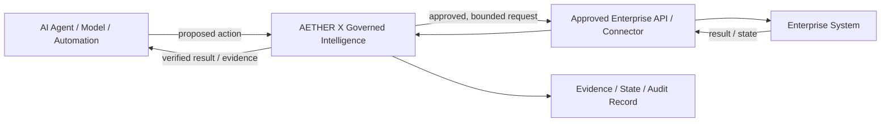

# AETHER X Governed Intelligence — Enterprise Integration Model

**Classification:** `PUBLIC · NON-CONFIDENTIAL · NON-ENABLING`  
**Organization:** AETHER X GLOBAL — currently under formation

---

## Purpose

This document explains, at a high level, how AETHER X Governed Intelligence is intended to fit into an enterprise AI workflow without disclosing proprietary implementation details.

The simplest mental model is:

> **AI systems propose or request actions. AETHER X provides a governed execution boundary before approved actions reach enterprise systems, then preserves the state and evidence needed to review what happened.**

This is a target integration model for evaluation and productization. It is **not** a claim that the current R&D baseline is production-ready.

---

## High-Level Integration Pattern



AETHER X is not intended to replace the enterprise system, the model, or the organization's existing business logic.

Its role is to create explicit boundaries around questions such as:

- What action is being requested?
- What identity or system is requesting it?
- Is the action within the authority granted for this workflow?
- What state was admitted before execution?
- What result came back from the enterprise system?
- Can an ambiguous or interrupted outcome be reconciled later?
- What evidence should remain available for review?

---

## Typical Request Flow

A simplified enterprise request may proceed as follows:

1. **An AI agent, model-enabled workflow or deterministic automation proposes an action.**
2. **The request enters the governed boundary.** AETHER X evaluates the declared authority and workflow state applicable to the agreed use case.
3. **Only an approved interface is used.** The action is passed toward an enterprise API, service or connector that the customer has explicitly allowed for the evaluation.
4. **The enterprise system performs its own function.** AETHER X does not replace the bank, telecom, ERP, CRM or other system of record.
5. **The result returns through the governed boundary.** The system can preserve execution state and evidence required by the agreed evaluation model.
6. **The result is returned to the requesting workflow or reviewer.** Execution completion and verified outcome remain conceptually distinct.

The exact controls, interfaces and evidence requirements depend on the customer, workflow and risk model.

---

## Evaluation Deployment Boundary

The first enterprise evaluation should normally be isolated from production systems and use synthetic or sanitized data unless a separately approved scope states otherwise.

A bounded evaluation may be arranged in a customer-controlled or jointly agreed test environment. The specific runtime packaging, networking, hosting and operational model are determined during technical scoping.

AETHER X does **not** publicly commit at this stage to a single final production packaging model such as SaaS-only, on-premises-only or source-code delivery.

`EVALUATION ARCHITECTURE ≠ PRODUCTION DEPLOYMENT COMMITMENT`

---

## Source Code and Intellectual Property

The standard evaluation path does not require transfer of AETHER X proprietary core source code.

Depending on future productization and commercial terms, an enterprise deployment could use an agreed software artifact, service boundary, containerized/runtime package or other controlled delivery mechanism. The exact mechanism is intentionally not fixed by this public document.

Ownership of the underlying AETHER X technology remains separate from a customer's licensed right to use an agreed deployment.

See [Intellectual Property Notice](../INTELLECTUAL_PROPERTY.md) and [Enterprise Evaluation & Licensing](./ENTERPRISE_EVALUATION.md).

---

## What This Public Model Does Not Claim

This document does not establish:

- production readiness;
- compatibility with every enterprise platform;
- a supported public SDK or public runtime package;
- regulatory approval or security certification;
- automatic failover, arbitrary split-brain safety or exactly-once external effects;
- a final commercial deployment topology;
- transfer of proprietary source code or implementation rights.

Those questions require customer-specific evaluation, additional engineering evidence and appropriate commercial/legal agreements.

---

## Recommended First Enterprise Step

For a qualified organization, the recommended sequence is:

```text
NON-CONFIDENTIAL SCOPING
        ↓
SELECT ONE LOW-RISK WORKFLOW
        ↓
AGREE TEST BOUNDARIES & SUCCESS CRITERIA
        ↓
BOUNDED NON-PRODUCTION EVALUATION
        ↓
JOINT EVIDENCE REVIEW
        ↓
DECIDE WHETHER A DEEPER PILOT IS JUSTIFIED
```

No production deployment decision is implied by successful completion of the first evaluation.

---

**AETHER X GLOBAL**  
*Institutional Intelligence. Governed Autonomy.*
